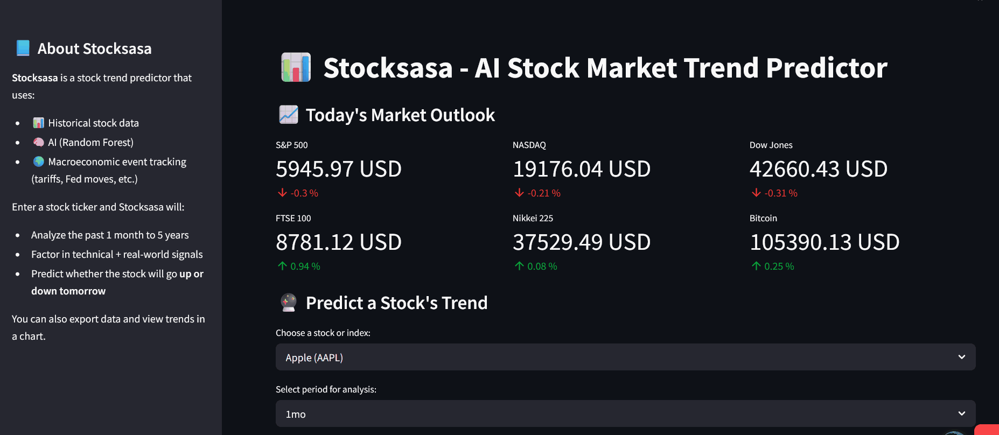

<h1 align="center">👋🏽 Welcome!</h1>

  
  
  
  

Software engineer based in Nairobi, KE, specializing in Java, Python, and Elixir, with a focus on building robust, high-performance systems. I design practical tools and user-friendly web applications that prioritize reliability, scalability, and clean architecture.

<h1 align="center">🦄 Projects</h1>
<table>
  <tr>
    <td width="50%" valign="top" align="center">
      <h3>Stocksasa</h3>
      
      

        Predictive market analytics for worldwide stocks using random forest ML algorithm. 
        <strong>Python, Streamlit, Random Forest classifier</strong>
      

      
      
    </td>

  <td width="50%" valign="top" align="center">
    <h3>IMDb Movie Recommender</h3>
    
    

      Content-based movie recommendation engine with genre and keyword vectorization. 
      <strong>Python, Streamlit, scikit-learn</strong>
    

    
    
  </td>  
  </tr>

  <tr>
    <td width="50%" valign="top" align="center">
      <h3>Payroll System</h3>
       
      

        Payroll web app with Kenyan salary and tax calculations. 
        <strong>Java, Springboot, MySQL</strong>
      

      
    </td>

  <td width="50%" valign="top" align="center">
    <h3>Intelligent Tutoring System</h3>
    
    

      Adaptive quiz generator and feedback system powered by NLP. 
      <strong>Python, Streamlit, spaCy</strong>
    

    
    
  </td>
  </tr>
</table>

<h1 align="center">🧙‍♂️ Arcana</h1>

   

   

   

 

